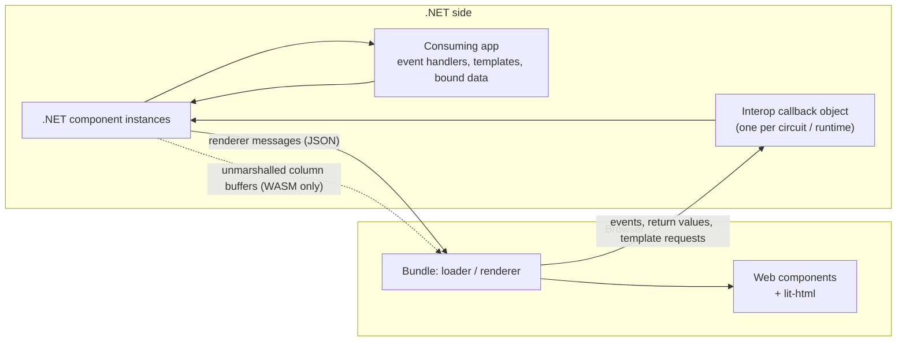

# Threat model — IgniteUI.Blazor.Lite

This document explains where the trust boundaries of `IgniteUI.Blazor.Lite` lie, what the library guarantees at each of them, and what remains the consuming application's responsibility. It builds on Microsoft's threat mitigation guidance for Blazor rather than repeating it; the [Threat mitigation](#4-threat-mitigation) section lists only what is specific to this library.

To report a suspected vulnerability, follow [`SECURITY.md`](../../SECURITY.md). Do not open a public issue.

## 1. Scope

**In scope**

- The managed library and the JavaScript bundle it ships: the .NET component classes, the interop layer between them and the browser, the bundled `igniteui-webcomponents` and `lit-html`, and the vendored `igniteui-core` sources.
- The build and release pipelines that produce and sign the NuGet package.

**Out of scope**

- The consuming application, including its authentication, authorization, data access and Content Security Policy.
- The internals of `igniteui-webcomponents` and `lit-html`. Both are maintained outside this repository, the former by Infragistics, and are not audited here. How this library uses them at the rendering boundary is in scope; the bundled versions are lockfile-pinned and covered by the dependency alerts described in [§6](#6-supply-chain-build-and-release).
- The ASP.NET Core Blazor framework. Its guarantees are assumed, not re-verified here.
- Storybook stories, tests and samples.

## 2. How the library works

Every component the application places in a Razor page is a **.NET component instance** that owns one **web component** in the browser. The .NET side is the source of truth: parameter values, bound data and template registrations flow to the browser as **renderer messages**, and the web component renders them. In the other direction the browser sends back DOM events, return values of methods the .NET side invoked, and requests to instantiate templates the application registered. All of that traffic enters .NET through a single **interop callback object** that is scoped to the Blazor circuit (or, in WebAssembly, to the runtime) and addresses the target component by an opaque container id.

On WebAssembly there is an additional **unmarshalled data channel**: unless the application opts for JSON, tabular bound data is handed to the bundle as typed column buffers that JavaScript reads directly from the managed heap.

## 3. Trust boundaries by hosting model

Where the trust boundary sits depends entirely on how the application hosts Blazor. In a Blazor Web App these are per-component render modes and one page can mix them. The library ships the same code for every model, so this section is the key to reading the rest of the document.

| Hosting model | Where .NET runs | Boundary | What Microsoft's guidance says |
|---|---|---|---|
| **Interactive Server** | On the server, inside a SignalR circuit | Browser → circuit. Every call from the bundle into the interop callback object is a call into the server. | [Interactive server-side rendering](https://learn.microsoft.com/aspnet/core/blazor/security/interactive-server-side-rendering): *"Treat any .NET method exposed to JavaScript as you would a public endpoint to the app."* Circuit and message-size limits bound resource exhaustion. |
| **WebAssembly** | In the browser, same origin as the page script | None inside the browser. The .NET runtime, the bundle and any attacker script share one origin on the user's machine; the security boundary is the application's own HTTP APIs. The origin sandbox and the CSP still bound what page script can do. | Microsoft publishes no separate threat-mitigation article for WebAssembly, because nothing on the client is trusted. Standard client-side rules apply: no secrets in the app, all authorization on the server. |
| **Auto** | On the server on the first visit, in the browser once the WebAssembly runtime is cached | Either of the two above, and the application cannot predict which. Reason about data exposure as for WebAssembly and about inbound cost as for Interactive Server. | Both of the above, per the mode in effect. |
| **Static SSR** | On the server, once, with no interactivity | Server → HTML. No interop ever runs. Components that render their web component element directly emit their set parameters as encoded element attributes; the rest emit a placeholder container, so the component itself renders nothing. Application child content renders as ordinary Razor content in either case. | [Static server-side rendering](https://learn.microsoft.com/aspnet/core/blazor/security/static-server-side-rendering). For this library the only exposure is which set parameter values appear as attributes in the page; child content is the application's own markup. |
| **Hybrid (WebView)** | In a native process hosting a WebView | Browser → native process. The same interop surface as Interactive Server, but the callee has the privileges of the host application rather than of a web server. | [Blazor Hybrid security considerations](https://learn.microsoft.com/aspnet/core/blazor/hybrid/security/security-considerations): treat the code inside the WebView as untrusted, and validate everything arriving from it, events and JS interop alike. |

In every interactive model, nothing crosses the outbound or inbound boundary until the component is interactive. Prerendered HTML carries only what static SSR would emit.

Three flows cross these boundaries:

- **Outbound: .NET → browser.** Renderer messages and, on WebAssembly, unmarshalled column buffers. The concern is *confidentiality*: which data leaves the .NET side.
- **Inbound: browser → .NET.** Events, method return values and template requests through the interop callback object. Under Interactive Server and Hybrid this is attacker-reachable input; the concern is *integrity* and *availability* of the .NET side.
- **Rendering: data → markup.** Bound values becoming DOM, on the server through Blazor's render tree and in the browser through lit-html. The concern is *script injection* into the application's origin.

The unmarshalled data channel is not a trust boundary. JavaScript reads memory at pointers and layouts the .NET side produced, and page script can already read the whole WebAssembly heap on its own. It is a memory-layout correctness concern, covered below, not an attacker-facing one.

## 4. Threat mitigation

The consuming application must first apply Microsoft's guidance for its hosting model. On top of that, the library guarantees the following properties.

### 4.1 Inbound interop

| Threat | What the library does |
|---|---|
| A client forges a call targeting another user's components | Impossible under Interactive Server. The interop callback object is handed to the browser as a reference scoped to one circuit, because `AddIgniteUIBlazor` registers the library's services per circuit; a caller can address only components registered in that circuit, and the container id is a lookup key inside it, never an authority. On WebAssembly and Hybrid there is one user per runtime and nothing to forge across. |
| A client raises an event the application did not subscribe to | Dropped. An event is dispatched only if the .NET component instance has a handler registered for that exact event name; unknown names are ignored. |
| A client-supplied payload activates an arbitrary .NET type or executes code | Not possible. Payloads are parsed with source-generated `System.Text.Json` into plain dictionaries and primitive values, and converted only into types the library itself defines; there is no polymorphic deserialization and no arbitrary type activation. Object references in a payload are resolved by id against registries of elements and bound data items the .NET side created. |
| A client instantiates arbitrary templates or content | Only templates the application registered on the component can be requested, and they render through Blazor `RenderFragment`s like any other Razor content. |
| Resource exhaustion through interop floods or oversized payloads | Bounded per payload and per connection, not per rate. `MaximumReceiveMessageSize` bounds each payload and `CircuitOptions` bounds retained circuits and unacknowledged render batches. The framework dispatches inbound invocations one at a time per connection, so one client's calls queue rather than interleave; dispatch is serialized, not completion, since the library hands an event to the application's handler without awaiting it, and that work draws on shared server CPU and memory. Neither the framework nor the library caps the call rate or the cumulative work and state a client accumulates on its circuit; see [§5](#5-guidance-for-application-developers). |

What remains after these guarantees is the same kind of risk as for a plain Blazor `@onclick`: a compromised client can fire a handler the application wired up, with arguments of the shape the application expects, and can answer a pending component method call with a value of its choosing. Nothing in an inbound payload identifies a user; the container id addresses a component, not a principal. Audit at the handler, from the circuit's authenticated identity. See [§5](#5-guidance-for-application-developers).

### 4.2 Rendering

| Threat | What the library does |
|---|---|
| A bound value is interpreted as HTML on the server | Never. Server-side markup is produced through `RenderTreeBuilder.AddContent` and `AddAttribute`, which encode. The only `AddMarkupContent` calls carry whitespace literals. Bound values are never wrapped in `MarkupString`. |
| A bound value is interpreted as HTML in the browser | Never through the library's own rendering. The bundle renders through `lit-html`, which sets text and attribute bindings through DOM APIs, so a bound value is never parsed as HTML. The vendored `igniteui-core` contains a string-concatenating `innerHTML` fallback renderer, but the bundle installs lit-html's renderer at module load and does not export the seam that would replace it, so the fallback is unreachable. Bound values reach the web components as property assignments; how a web component renders its properties belongs to `igniteui-webcomponents` ([§1](#1-scope)). URL-valued parameters such as `Href` and `Src` are passed through as written, the same as a plain `<a href>` in Razor; see [§5](#5-guidance-for-application-developers). |
| Dynamic code in the bundle requires `unsafe-eval` | Not required. The bundle contains no `eval` or `new Function`, and the production build uses `hidden-source-map`, not an eval-based devtool. Applications can run the bundle under a CSP without `unsafe-eval`. |

Content the application renders *inside* a component is the application's own code and is subject to the same rules as anywhere else in the app. This covers Razor templates and child content, which render as ordinary `RenderFragment`s, and the `*Script` parameters, which name a client-side function the application registered through `igRegisterScript`. A script id selects only among registered functions, and an unregistered name resolves to nothing, but the function itself is application JavaScript running in the page origin, so what it writes into the DOM is outside the library's rendering guarantees.

### 4.3 Outbound data

| Threat | What the library does |
|---|---|
| Bound data reaches the browser beyond what is displayed | Data-bound components serialize the **public properties and fields** of the bound item type, not only the members a template happens to render. The transfer happens once the component is interactive; static SSR and prerendered HTML carry no bound data ([§3](#3-trust-boundaries-by-hosting-model)). Narrow the type before binding; see *Bind projections, not entities* in [§5](#5-guidance-for-application-developers). |
| Interop payloads appear in logs | The managed library logs no event arguments, renderer messages or bound values; it writes caught exceptions to the console. The browser bundle reports interop failures to the developer console, so a failing call can surface fragments of its payload there. |

Not a threat, recorded because [§3](#3-trust-boundaries-by-hosting-model) refers to it: the unmarshalled data channel depends on the .NET writer and the JavaScript reader agreeing on a fixed column layout. The channel uses `InvokeUnmarshalled` where the in-process runtime still offers it (.NET 8) and raw pointers otherwise (.NET 9 and later). Unit tests drive the writer on every target framework through a test double; the real browser transport is exercised only on .NET 10 by the Playwright suite. In the other interactive models, and when the application opts for JSON, the same data travels as JSON.

## 5. Guidance for application developers

Everything else on Microsoft's pages, including CSRF, click-jacking, WebSocket compression side channels and open redirects, applies to the application unchanged and is not repeated here.

- **Treat event arguments and method return values as user input.** Anything a handler receives from a component event, and anything a component method returns, is read from the browser. Validate it as you would a form post before acting on it, and never derive authorization from it.
- **Don't treat component state as an authorization check.** `Disabled`, `Selected`, the active step and similar live in the browser and can be fired past. Re-check the precondition inside the handler, against .NET state, exactly as you would for a plain `@onclick`.
- **Bind projections, not entities.** Every public property and field of a bound item type is serialized to the browser once the component is interactive. Map to a view model that holds only what the component needs.
- **Authorize before binding.** Components perform no authentication or authorization. Data handed to a component has already passed the application's filters.
- **Validate URLs before binding them.** `Href`, `Src` and similar reach the DOM unmodified; prefer relative links and validate absolute ones against a set of allowed origins, as the [open redirects](https://learn.microsoft.com/aspnet/core/blazor/security/interactive-server-side-rendering#open-redirects) section of Microsoft's guidance describes.
- **Keep script ids static.** `*Script` parameters name application JavaScript registered through `igRegisterScript`. Never bind them from user input.
- **Under Interactive Server, size the circuit limits deliberately.** `MaximumReceiveMessageSize` on the hub and the retention and buffering limits in `CircuitOptions` bound what one client can hold on the server. Leave them at their defaults unless measured payloads require otherwise, test the result as Microsoft's guidance describes, and limit connections per user at the application or gateway level. Neither the framework nor the library rate-limits inbound callbacks.
- **Under Interactive Server, be deliberate with continuous events.** `Input`, `InputOcurred` and `Hover` fire per keystroke or pointer move, each a round trip over the circuit. Prefer `Change` where it suffices, and debounce what you keep.
- **Apply a Content Security Policy.** A CSP and an XSS-free application keep other people's script out of the page. They are defence in depth, not a guarantee, and they do not constrain a user who controls their own browser; the guarantees in [§4.1](#41-inbound-interop) and the first item above cover that case. The library runs without `unsafe-eval`. Load third-party scripts only from origins the policy allows, with Subresource Integrity where possible, following [Microsoft's Blazor CSP guidance](https://learn.microsoft.com/aspnet/core/blazor/security/content-security-policy).
- **In Hybrid apps, treat WebView content as untrusted.** The interop callback object has the privileges of the host process; validate everything arriving from the WebView, as Microsoft's Hybrid security considerations describe. Everything you bind is serialized into the WebView, which must not hold credentials, tokens or sensitive user data.

## 6. Supply chain, build and release

- **Static analysis** — GitHub CodeQL code scanning (default setup) analyses C# and JavaScript/TypeScript on pushes and pull requests; findings of high severity or above block merging.
- **Dependency alerts** — GitHub Dependabot alerts and security updates cover the NuGet, npm and GitHub Actions manifests; version updates are configured for GitHub Actions with a 14-day cooldown and security updates fast-tracked.
- **Release integrity** — Authenticode signing of all DLLs followed by a signature validation gate; NuGet package signing followed by `dotnet nuget verify`.
- **Credential hygiene** — Azure OIDC federation and NuGet Trusted Publishing with short-lived OIDC-issued keys; no long-lived publish secrets.
- **Least privilege and pinning** — workflow-level `contents: read` or no permissions by default, `id-token: write` granted per job, `contents: write` only on the job that attaches release evidence, publishing gated behind the `nuget-org-publish` environment, release actions pinned to commit SHAs.
- **Reproducible inputs** — `npm ci` without package-manager caching in release builds, `<Deterministic>true</Deterministic>`, central package version management.
- **Compiler safety** — the library compiles with `Nullable` enabled and nullable warnings as errors, and is trim-compatible with the trim analyzer warning-free. `AllowUnsafeBlocks` is enabled solely for the unmarshalled data channel.
- **Testing** — bUnit unit tests, including the unmarshalled channel, and Playwright integration tests run in CI.

## 7. Reporting and disclosure

Suspected vulnerabilities are reported privately as described in [`SECURITY.md`](../../SECURITY.md), which also states the acknowledgement and triage timelines. Fixes are communicated through the channels `SECURITY.md` lists, a GitHub Security Advisory or release notes, as the severity warrants. Findings that require action by application developers are added to [§5](#5-guidance-for-application-developers).

## 8. References

- [`SECURITY.md`](../../SECURITY.md) — vulnerability reporting and disclosure policy.
- [Threat mitigation guidance for ASP.NET Core Blazor interactive server-side rendering](https://learn.microsoft.com/aspnet/core/blazor/security/interactive-server-side-rendering)
- [Threat mitigation guidance for ASP.NET Core Blazor static server-side rendering](https://learn.microsoft.com/aspnet/core/blazor/security/static-server-side-rendering)
- [ASP.NET Core Blazor Hybrid security considerations](https://learn.microsoft.com/aspnet/core/blazor/hybrid/security/security-considerations)
- [Enforce a Content Security Policy for ASP.NET Core Blazor](https://learn.microsoft.com/aspnet/core/blazor/security/content-security-policy)
- [ASP.NET Core Blazor authentication and authorization](https://learn.microsoft.com/aspnet/core/blazor/security/)
- [Prevent cross-site scripting (XSS) in ASP.NET Core](https://learn.microsoft.com/aspnet/core/security/cross-site-scripting)
- [Microsoft Security Development Lifecycle: threat modeling](https://www.microsoft.com/en-us/securityengineering/sdl/threatmodeling)
