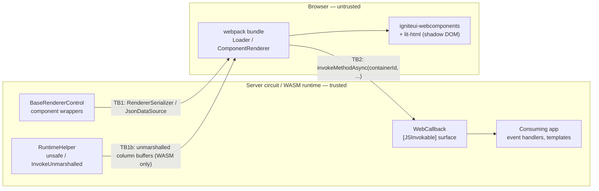

# Threat model — IgniteUI.Blazor.Lite

| | |
|---|---|
| **Status** | Draft — awaiting maintainer review |
| **Package in scope** | `IgniteUI.Blazor.Lite` (net8.0 / net9.0 / net10.0) |
| **Repository** | https://github.com/IgniteUI/igniteui-blazor |
| **Reviewed commit** | <!-- TODO(maintainer): SHA at time of sign-off --> |
| **Document owner** | <!-- TODO(maintainer): name --> |
| **Last updated** | 2026-08-11 |
| **Method** | STRIDE per trust-boundary, mapped to Microsoft's Blazor threat-mitigation guidance |

## 1. Scope

**In scope**

- Managed code under `src/` (notably `src/componentsBase/`) and the webpack bundle produced from `src/src/` (`igniteui-webcomponents`, `igniteui-core`, `lit-html`) plus the themes copied into `src/wwwroot/`.
- The build and release pipelines that produce and sign the package.

**Out of scope**

- The consuming application.
- Internal implementation of `igniteui-webcomponents` / `igniteui-core` / `lit-html` — trusted-but-verified dependencies; their behaviour at the rendering boundary *is* in scope (TM-DOM-01).
- The ASP.NET Core Blazor framework. Framework guarantees are assumptions ([§4](#4-assumptions-and-consumer-responsibilities)).
- Storybook stories, tests and samples.

## 2. Architecture and trust boundaries

Three boundaries:

- **TB1 — server → client.** Component state and bound data serialized to the browser.
- **TB1b — managed → WASM heap.** The unmarshalled fast path; a *memory-safety* boundary, not just a trust boundary. Unique to this package.
- **TB2 — client → server.** Attacker-controlled input. Per Microsoft's guidance, *"Treat any .NET method exposed to JavaScript as you would a public endpoint to the app."*

## 3. Assets and security objectives

| Asset | Objective |
|---|---|
| Consumer data bound to components | Confidentiality — only intended fields reach the browser |
| The Blazor circuit and the WASM heap | Availability and memory integrity |
| The consuming app's browser origin | Integrity — components never introduce script execution |
| The published NuGet package | Integrity — signed, reproducible, no unintended content |

## 4. Assumptions and consumer responsibilities

| # | Assumption |
|---|---|
| A1 | The consuming app enforces authentication/authorization; components perform none. |
| A2 | The consuming app enforces a Content Security Policy appropriate to its render mode. |
| A3 | The consuming app is free of XSS. Most TB2 threats require attacker script in the page; per Microsoft's guidance an XSS-compromised client can already forge interop calls. The library's obligation is to avoid *causing* XSS and to avoid *widening* the blast radius. |
| A4 | Data bound to components has already passed the app's authorization filter. |
| A5 | Framework limits (`CircuitOptions`, `MaximumReceiveMessageSize`, interop call timeout) are left at or below their defaults. |

## 5. Analysis areas

Threat identification is performed per trust boundary against the areas below. This document records **what is analysed and how**; the concrete findings produced by that analysis are **not published here** — see [§6](#6-how-findings-are-handled).

| Area | Boundary | What is analysed |
|---|---|---|
| JS interop callback surface | TB2 | Every `[JSInvokable]` entry point: caller identification, parameter typing, deserialization of client-supplied payloads, and the routing of untrusted event data into consumer handlers. |
| Unmarshalled data path | TB1b | Memory safety and layout agreement between the managed side and the JS reader, plus behaviour when the fast path is unavailable. |
| Serialization boundary | TB1 | What consumer data leaves the server, and its exposure under prerendering. |
| Rendering path | TB1 | Whether bound values can reach markup-interpreting APIs (`AddMarkupContent`, `innerHTML`, `unsafeHTML`), and dynamic-code constructs (`eval`, `new Function`). |
| Supply chain, build and release | — | Bundled third-party JavaScript, dependency scanning coverage, signing and signature-validation gates, and the compiler safety settings of the shipped project. |

## 6. How findings are handled

Findings are **tracked privately**, not enumerated in this repository. Publishing an unfixed, exploitable weakness ahead of a fix would put consumers at risk, so this document defines the process instead of the results.

1. **Recording.** Each finding is filed in the maintainers' private security tracker with an identifier, the trust boundary, a STRIDE classification and a residual severity assessed **given** A1–A5.
2. **Triage.** Findings are triaged under the timelines published in [`SECURITY.md`](../../SECURITY.md) — acknowledgement within 3 business days, triage within 7 business days — regardless of whether they originated internally or from an external reporter.
3. **Disposition.** Every finding reaches one of: `Fixed`, `Mitigated` (a named compensating control), `By design` (documented consumer responsibility), or `Accepted` (residual risk with a named approver and a date).
4. **Release gate.** No finding of severity High or above may ship while it is still open. The gate is enforced at review time via [review-template.md](review-template.md).
5. **Disclosure.** Fixed findings are disclosed after a fix is available, through a GitHub Security Advisory and the release notes, following the coordinated-disclosure process in `SECURITY.md`. Consumer-facing findings that require action by the application developer are additionally documented in the public product documentation.
6. **Re-analysis triggers.** The analysis in [§5](#5-analysis-areas) is re-run whenever the JS interop surface, the unmarshalled data path, or the bundled third-party JavaScript changes, and at minimum once per major release.

To report a suspected vulnerability, follow [`SECURITY.md`](../../SECURITY.md). Please do not open a public issue.

## 7. Existing controls

Verified in `.github/workflows/igniteui-blazor-lite-release.yml`, `ci.yml` and the build props:

- **Release integrity** — Authenticode signing of all DLLs with a post-sign verification gate; NuGet package signing followed by `dotnet nuget verify`.
- **Credential hygiene** — Azure OIDC federation and NuGet Trusted Publishing via short-lived OIDC-issued API keys; no long-lived publish secrets.
- **Action pinning** — release-workflow actions are pinned to **commit SHAs**, not tags.
- **Least privilege** — repository-level `permissions: contents: read`, job-scoped `id-token: write`, publishing gated behind the protected `nuget-org-publish` environment.
- **Reproducible dependency install** — `npm ci` with `package-manager-cache: false` in release builds ("never use caching in release builds").
- **Deterministic builds** — `<Deterministic>true</Deterministic>` in `Directory.Build.props`.
- **Central package management** — `Directory.Packages.props` with `ManagePackageVersionsCentrally`.
- **Disclosure process** — a complete `SECURITY.md`: private reporting (GitHub PVR → email → support case), 3/7-business-day acknowledgement/triage SLAs, severity bands, coordinated disclosure, advisories.
- **Dependency updates** — Dependabot for GitHub Actions with a 14-day cooldown and security updates fast-tracked outside the batch.
- **Testing** — bUnit unit tests plus Playwright integration tests with coverage in CI.

## 8. Residual risk

Accepted residual risks are recorded against their finding in the private tracker and in the corresponding security review record, each with a named approver and a date. They are not itemised here. Residual risks that require action or awareness on the consuming application's part are surfaced in the public product documentation and in [§4](#4-assumptions-and-consumer-responsibilities) ("Assumptions and consumer responsibilities").

## 9. Review and sign-off log

| Version | Commit | Reviewers | Date | Open Critical/High | Outcome |
|---|---|---|---|---|---|
| <!-- TODO --> | | | | | |

Release gate: **no `Open` finding of severity High or above may ship.**

## 10. References

- [`SECURITY.md`](../../SECURITY.md) — this repository's vulnerability reporting and disclosure policy.
- [`CONTRIBUTING.md`](../../.github/CONTRIBUTING.md) — contribution and review process.
- [review-template.md](review-template.md) — the security review record template.
- [Threat mitigation guidance for ASP.NET Core Blazor interactive server-side rendering](https://learn.microsoft.com/aspnet/core/blazor/security/interactive-server-side-rendering)
- [ASP.NET Core Blazor authentication and authorization](https://learn.microsoft.com/aspnet/core/blazor/security/)
- [Prevent cross-site scripting (XSS) in ASP.NET Core](https://learn.microsoft.com/aspnet/core/security/cross-site-scripting)
- [Microsoft Threat Modeling / STRIDE](https://learn.microsoft.com/azure/security/develop/threat-modeling-tool-threats)
