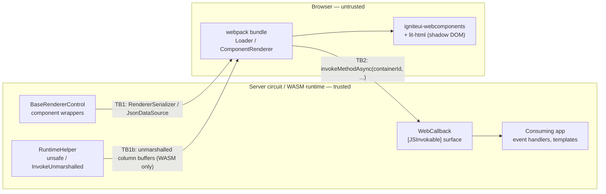

# Threat model — IgniteUI.Blazor.Lite and IgniteUI.Blazor.Templates

| | |
|---|---|
| **Status** | Draft — awaiting maintainer review |
| **Packages in scope** | `IgniteUI.Blazor.Lite` (net8.0 / net9.0 / net10.0), `IgniteUI.Blazor.Templates` (netstandard2.0, `PackageType=Template`) |
| **Repository** | https://github.com/IgniteUI/igniteui-blazor |
| **Reviewed commit** | <!-- TODO(maintainer): SHA at time of sign-off --> |
| **Document owner** | <!-- TODO(maintainer): name --> |
| **Last updated** | 2026-08-11 |
| **Method** | STRIDE per trust-boundary, mapped to Microsoft's Blazor threat-mitigation guidance |

## 1. Why this document exists

Microsoft requires a maintained security/threat model and a completed security review
before a third-party Blazor component package can be endorsed alongside their own
components. This document is the threat model half of that requirement. It is a **living
document**: it is updated whenever the JS interop surface, the unmarshalled data path, the
bundled third-party JavaScript, or the template content changes.

It is not a penetration test, not an audit, and not an attestation of security.

The two packages have **different threat classes** and are modelled separately:
`IgniteUI.Blazor.Lite` is a runtime interop surface; `IgniteUI.Blazor.Templates` is a
supply-chain and secure-defaults surface.

## 2. Scope

**In scope**

- `IgniteUI.Blazor.Lite`: managed code under `src/` (notably `src/componentsBase/`) and the
  webpack bundle produced from `src/src/` (`igniteui-webcomponents`, `igniteui-core`,
  `lit-html`) plus the themes copied into `src/wwwroot/`.
- `IgniteUI.Blazor.Templates`: the `dotnet new` template content under
  `templates/IgniteUI.Blazor.Templates/templates/` and how it is packed.
- The build and release pipelines that produce and sign both packages.

**Out of scope**

- The consuming application, and applications generated from the templates once the
  developer has modified them.
- Internal implementation of `igniteui-webcomponents` / `igniteui-core` / `lit-html` —
  trusted-but-verified dependencies; their behaviour at the rendering boundary *is* in
  scope (TM-DOM-01).
- The ASP.NET Core Blazor framework. Framework guarantees are assumptions (§5).
- Storybook stories, tests and samples.

## 3. Architecture and trust boundaries

Three boundaries:

- **TB1 — server → client.** Component state and bound data serialized to the browser.
- **TB1b — managed → WASM heap.** The unmarshalled fast path; a *memory-safety* boundary,
  not just a trust boundary. Unique to this package.
- **TB2 — client → server.** Attacker-controlled input. Per Microsoft's guidance, *"Treat
  any .NET method exposed to JavaScript as you would a public endpoint to the app."*

## 4. Assets and security objectives

| Asset | Objective |
|---|---|
| Consumer data bound to components | Confidentiality — only intended fields reach the browser |
| The Blazor circuit and the WASM heap | Availability and memory integrity |
| The consuming app's browser origin | Integrity — components never introduce script execution |
| The two published NuGet packages | Integrity — signed, reproducible, no unintended content |
| Applications scaffolded from the templates | Integrity — secure-by-default starting posture |

## 5. Assumptions and consumer responsibilities

| # | Assumption |
|---|---|
| A1 | The consuming app enforces authentication/authorization; components perform none. |
| A2 | The consuming app enforces a Content Security Policy appropriate to its render mode. |
| A3 | The consuming app is free of XSS. Most TB2 threats require attacker script in the page; per Microsoft's guidance an XSS-compromised client can already forge interop calls. The library's obligation is to avoid *causing* XSS and to avoid *widening* the blast radius. |
| A4 | Data bound to components has already passed the app's authorization filter. |
| A5 | Framework limits (`CircuitOptions`, `MaximumReceiveMessageSize`, interop call timeout) are left at or below their defaults. |
| A6 | Developers using the templates review and adapt the generated security configuration before production deployment. |

## 6. Threats — `IgniteUI.Blazor.Lite`

Severity is the residual severity **given** A1–A6. Status: `Open`, `Mitigated`,
`By design`, `Accepted`, `Verified — no finding`.

### TB2 — client → server (JS interop callbacks)

| ID | Threat | STRIDE | Sev | Status |
|---|---|---|---|---|
| **TM-IX-01** | `WebCallback` is a **public** class whose `[JSInvokable]` methods (`OnReady`, `OnInvokeReturn`, `OnRaiseEvent`, `AdjustDynamicContent`, `AdjustDynamicContentBatch`) all take a **client-supplied `containerId`** used as a key into a process-wide `_controlsMap`. A caller that reaches the reference can address *any* registered control in the circuit, not only the one it legitimately owns — event raising and dynamic-content mutation can be driven cross-instance. This is the largest single item in the model. | S, T, E | **High** | **Open** |
| **TM-IX-02** | `OnInvokeReturn` accepts `object returnValue` — an untyped, polymorphic value deserialized from the client and passed on to `control.OnInvokeReturn`. Weakest input contract in the surface. | T, E | Medium | **Open** |
| **TM-IX-03** | `AdjustDynamicContentBatch` deserializes a client-supplied `batch` string into a dictionary array and iterates it, driving render-tree mutation from untrusted input. | T, D | Medium | **Open** |
| **TM-IX-04** | `_controlsMap` is keyed by `ContainerId` and populated via `Register`, with no validation that the caller is entitled to that key, and `Add` (not indexer assignment) will throw on a duplicate key. | S, D | Medium | **Open** |
| **TM-IX-05** | Untrusted event args flow into consumer event handlers. If the app forwards them into dynamic LINQ, SQL or reflection, this becomes injection. | T, E | High *(consumer-facing)* | **Open** — needs documentation |

### TB1b — memory safety (WASM unmarshalled path)

| ID | Threat | STRIDE | Sev | Status |
|---|---|---|---|---|
| **TM-MEM-01** | `RuntimeHelper` reflection-discovers `InvokeUnmarshalled` on the WASM runtime, builds a delegate with `Expression.Compile()`, and invokes it from `unsafe` methods passing `UnmarshalledColumn[]` — raw pointers into the WASM heap. `AllowUnsafeBlocks=true`. A mismatch between the managed layout and the JS-side reader is a memory-corruption / type-confusion condition rather than a normal exception. | T, E | **High** | **Open** — needs justification or scope limit |
| **TM-MEM-02** | The unmarshalled API is deprecated and reached only by reflection, so a runtime change silently disables the fast path. Behaviour then diverges between runtimes with no signal. | R | Low | **Open** |
| **TM-MEM-03** | `Expression.Compile()` requires a JIT and is incompatible with full AOT/trimming. A compatibility constraint rather than a vulnerability, recorded here because it constrains the mitigation options for TM-MEM-01. | — | — | **Note** |

### TB1 — server → client (serialization and rendering)

| ID | Threat | STRIDE | Sev | Status |
|---|---|---|---|---|
| **TM-SER-01** | Bound data is serialized to the browser through `JsonDataSource` / `RendererSerializer`. Consumers binding ORM entities ship every property — including PII and internal fields — to the client. | I | High *(consumer-facing)* | **Open** — needs documentation |
| **TM-SER-02** | Under server-side prerendering the serialized state is embedded in the initial HTML response and subject to intermediary/browser caching. | I | Low | **Accepted** |
| **TM-DOM-01** | Whether `igniteui-webcomponents` / `lit-html` render bound values as text or as markup determines whether untrusted data yields DOM XSS. `lit-html` escapes interpolations by default but exposes `unsafeHTML`; usage must be confirmed for the shipped component set. To resolve: confirm with the `igniteui-webcomponents` team whether any bound value reaches `unsafeHTML`, `innerHTML` or `insertAdjacentHTML`, and record the answer plus the version it was verified against. | T | **To determine** | **Open** — must be answered before sign-off |
| **TM-DOM-02** | Consumer-supplied `RenderFragment` templates (`IgbTemplateContent`) render arbitrary consumer markup inside component-owned containers. Razor escapes `@value` by default, so this is safe unless the consumer opts into `MarkupString`. | T | Low | **By design** — documented consumer responsibility |
| — | `DynamicContentHolder.BuildRenderTree` calls `AddMarkupContent`. Microsoft's guidance explicitly names this API as an XSS vector when passed user input. **Verified**: every call site passes a static whitespace literal (`"\r\n"`, indentation) — never user data. | — | — | **Verified — no finding** |
| — | `eval` / `new Function` in first-party TypeScript. None present. | — | — | **Verified — no finding** |

### Supply chain, build and release

| ID | Threat | STRIDE | Sev | Status |
|---|---|---|---|---|
| **TM-SC-01** | `igniteui-webcomponents` (`~7.2.4`) and `lit-html` are bundled *inside* the .nupkg. Consumers cannot patch an upstream JS CVE independently. Upstream CVEs are handled under the `SECURITY.md` disclosure SLAs: acknowledgement within 3 business days, triage within 7 business days, fix timeline by severity. | T | Medium | **By design** — covered by the published SLAs |
| **TM-SC-02** | No SCA, CodeQL, `npm audit` or dependency-review gate. `ci.yml` runs formatting, build and tests only. | — | **High** | **Open** |
| **TM-BLD-01** | `igniteui-blazor-lite-release.yml` references `${{ env.BUILD_CONFIGURATION }}` in the signing and signature-validation steps, but that variable is **never defined**. It expands to empty, so the signing base directory becomes `src/bin/` rather than `src/bin/Release/`. It currently works only because the recursive `**/*.dll` glob still reaches the Release output — the integrity gate is scanning an unintended path. | T, R | Medium | **Open** |
| **TM-BLD-02** | Unlike the DLL step, "Validate DLL signatures" does not fail when *zero* DLLs are found — an empty result set passes the gate. | R | Medium | **Open** |
| **TM-BLD-03** | `<Nullable>disable</Nullable>` on `IgniteUI.Blazor.Lite.csproj` (generated sources are unannotated), removing compiler-enforced null safety across the shipped surface. | — | Low | **Accepted** — tracked TODO in the project file |

## 7. Threats — `IgniteUI.Blazor.Templates`

A template package executes no code at runtime; its risk is what it *emits* and what it
*carries*.

| ID | Threat | STRIDE | Sev | Status |
|---|---|---|---|---|
| **TM-PKG-01** | `NoDefaultExcludes=true` combined with `Content Include="templates\**\*"` excluding only `bin`/`obj` packs **everything else in the tree** — dotfiles, `.env`, editor state, stray credentials — into the shipped package. | I | **High** | **Open** |
| **TM-PKG-02** | `test-templates.ps1` / `test-templates.sh` live in the template project; must be confirmed not to land under `content/`. | I | Medium | **Open** |
| **TM-TPL-01** | Insecure defaults in the scaffolded app (missing CSP, HSTS, HTTPS redirection, antiforgery; any CDN `<script>`/`<link>` without SRI) are replicated into every consumer project. Highest-leverage item in the template package. | T, I | **High** | **Open** — requires a secure-defaults checklist |
| **TM-TPL-02** | Template-pinned package versions drift from the libraries and go stale, scaffolding projects onto known-vulnerable versions. | T | Medium | **Open** |
| **TM-TPL-03** | `<Version>0.0.1</Version>` is hard-coded in the template project rather than driven by the release tag. | R | Low | **Open** |

## 8. Existing controls

Verified in `.github/workflows/igniteui-blazor-lite-release.yml`, `ci.yml` and the build props:

- **Release integrity** — Authenticode signing of all DLLs with a post-sign verification
  gate; NuGet package signing followed by `dotnet nuget verify`.
- **Credential hygiene** — Azure OIDC federation and NuGet Trusted Publishing via
  short-lived OIDC-issued API keys; no long-lived publish secrets.
- **Action pinning** — release-workflow actions are pinned to **commit SHAs**, not tags.
- **Least privilege** — repository-level `permissions: contents: read`, job-scoped
  `id-token: write`, publishing gated behind the protected `nuget-org-publish` environment.
- **Reproducible dependency install** — `npm ci` with `package-manager-cache: false` in
  release builds ("never use caching in release builds").
- **Deterministic builds** — `<Deterministic>true</Deterministic>` in `Directory.Build.props`.
- **Central package management** — `Directory.Packages.props` with
  `ManagePackageVersionsCentrally`.
- **Disclosure process** — a complete `SECURITY.md`: private reporting (GitHub PVR → email
  → support case), 3/7-business-day acknowledgement/triage SLAs, severity bands,
  coordinated disclosure, advisories.
- **Dependency updates** — Dependabot for GitHub Actions with a 14-day cooldown and
  security updates fast-tracked outside the batch.
- **Testing** — bUnit unit tests plus Playwright integration tests with coverage in CI.

## 9. Residual risk

| ID | Accepted risk | Justification | Approver | Date |
|---|---|---|---|---|
| TM-SER-02 | Prerendered state in initial HTML | Inherent to Blazor SSR; mitigated by app-level cache headers | <!-- TODO --> | |
| TM-DOM-02 | Consumer templates render consumer markup | Razor escapes by default; `MarkupString` is an explicit consumer opt-in | <!-- TODO --> | |
| TM-SC-01 | Bundled third-party JS | Required for a single-package consumer experience; offset by the `SECURITY.md` disclosure SLAs (3-day acknowledgement, 7-day triage, fix by severity) applying equally to upstream CVEs | <!-- TODO --> | |
| TM-BLD-03 | `Nullable` disabled on the Lite project | Generated sources are unannotated; enabling would emit thousands of warnings | <!-- TODO --> | |

## 10. Review and sign-off log

| Package | Version | Commit | Reviewers | Date | Open Critical/High | Outcome |
|---|---|---|---|---|---|---|
| <!-- TODO --> | | | | | | |

Release gate: **no `Open` finding of severity High or above may ship.**

## 11. References

See [PR.md](../../PR.md#references) in the repository root.
